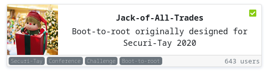

Difficulty: *Medium*

```
IP: 10.10.249.80
```


Old versions: 
* OpenSSH 6.7p1 Debian 5 (protocol 2.0) (port 80)
* Apache httpd 2.4.10 ((Debian)) (port 22)

(Yeah btw the ports are swapped [Check the Scan](nmap/initial))
So for the challanges I had to modify Firefox's settings [Check out the forum](http://forums.mozillazine.org/viewtopic.php?f=38&t=551830)

http://10.10.249.80:22/assets/stego.jpg Steghide ???

In comments of the site:
```
UmVtZW1iZXIgdG8gd2lzaCBKb2hueSBHcmF2ZXMgd2VsbCB3aXRoIGhpcyBjcnlwdG8gam9iaHVudGluZyEgSGlzIGVuY29kaW5nIHN5c3RlbXMgYXJlIGFtYXppbmchIEFsc28gZ290dGEgcmVtZW1iZXIgeW91ciBwYXNzd29yZDogdT9XdEtTcmFxCg== 
```

Wich means
```
Remember to wish Johny Graves well with his crypto jobhunting! His encoding systems are amazing! Also gotta remember your password: u?WtKSraq
```

Checked stego.jpg and got creds.txt that said
```
Hehe. Gotcha!

You're on the right path, but wrong image!
```

Tried all the images and found on the header : (the file is called cms.creds)
```
Here you go Jack. Good thing you thought ahead!

Username: jackinthebox
Password: TplFxiSHjY
```

Tried on /recovery.php
and got 
```
GET me a 'cmd' and I'll run it for you Future-Jack. 
```

Giving a cmd GET variable got a shell
Ok time to get a revshell !

I found a wordlist in /home/
and got this password: ITMJpGGIqg1jn?>@ (for jack SSH)

OWN root with Dirycow :heart:
