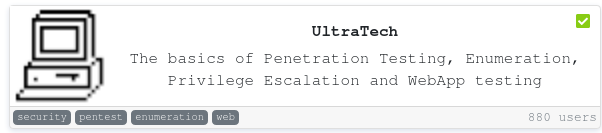

Difficulty: *Medium*

```
IP: 10.10.25.238
```

# Infos

* ultratech@yopmail.com
* Login on http://10.10.25.238:31331/partners.html
* Command execution on http://10.10.25.238:8081/ping?ip=`**id**`
* Found out that the r00t user use the same password as the admin of the page 
* r00t could run docker container
* After runing a container found out that one of them as access the HOST OS
* With that cat out /root/.ssh/rsa_id

END !
